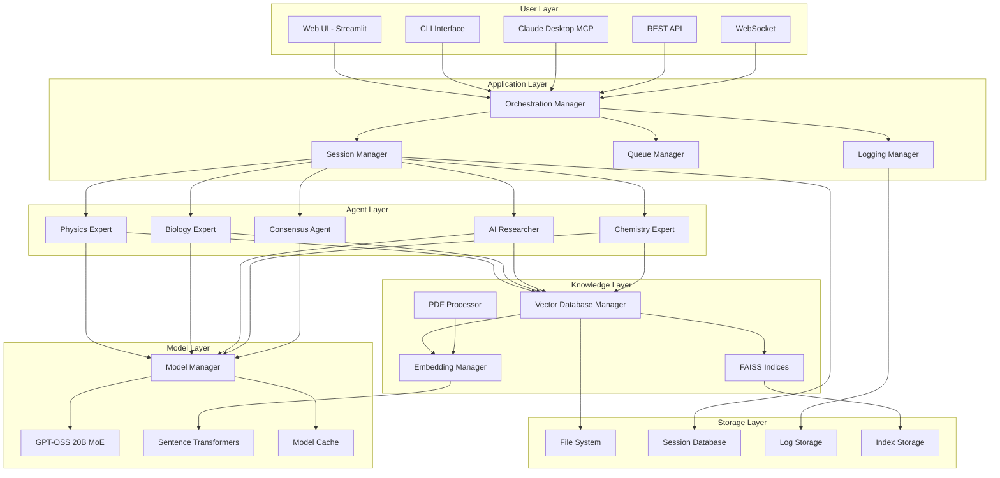
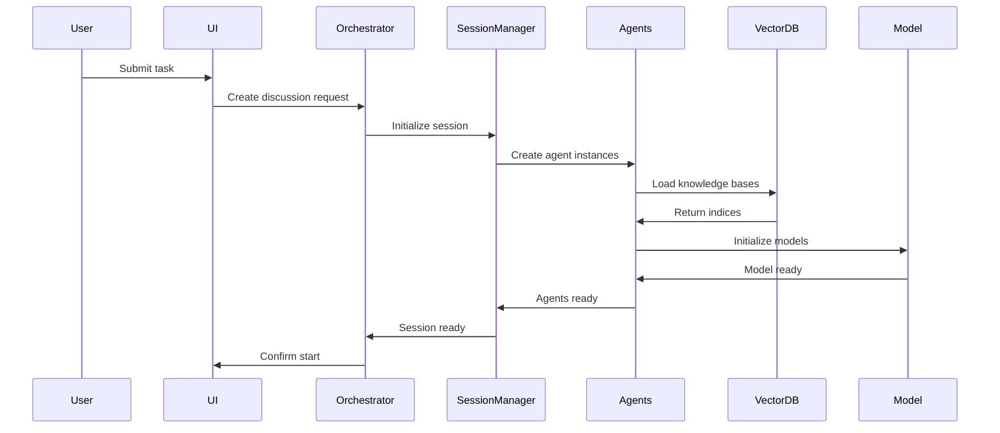
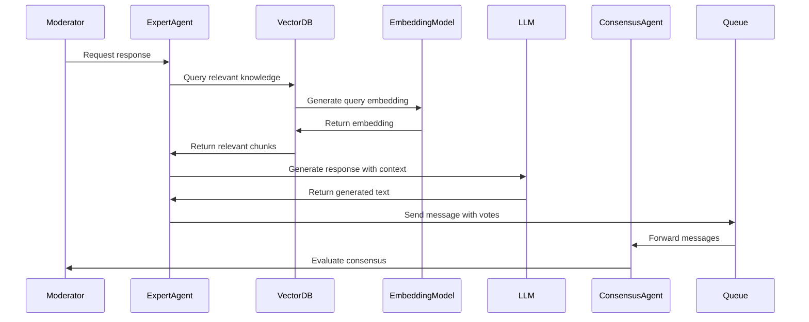
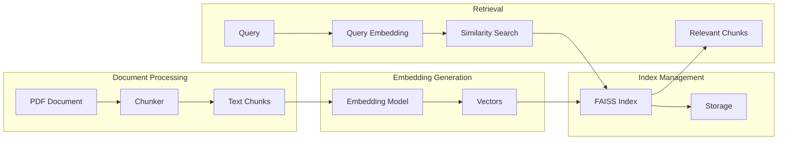

# 🏗️ System Architecture

## Table of Contents
- [Overview](#overview)
- [System Components](#system-components)
- [Data Flow](#data-flow)
- [Component Details](#component-details)
- [Design Patterns](#design-patterns)
- [Scalability Considerations](#scalability-considerations)
- [Security Architecture](#security-architecture)

## Overview

The Multi-Agent Discussion System follows a layered architecture pattern with clear separation of concerns. The system is designed to be modular, scalable, and maintainable, supporting both local and cloud deployments.

## System Components

### High-Level Architecture



## Data Flow

### 1. **Discussion Initiation Flow**



### 2. **Agent Discussion Flow**



### 3. **RAG Pipeline Flow**



## Component Details

### 1. **GPT-OSS 20B Model Integration**

**[Detailed Documentation: GPT_OSS_MODEL.md]**

**Current State**: ✅ Successfully integrated and operational

**Model Specifications**:
- **Architecture**: Mixture of Experts (MoE) with 32 experts, 4 active per token
- **Parameters**: 21B total, 3.6B active per token
- **Storage**: 13.7GB safetensors format
- **Location**: `C:\Users\maxli\.cache\huggingface\hub\models--openai--gpt-oss-20b\`
- **Dtype**: bfloat16 (required, float16 causes errors)
- **Quantization**: MXFP4 (falls back to BF16 on Windows)

**Loading Configuration**:
```python
model = AutoModelForCausalLM.from_pretrained(
    model_path,
    torch_dtype=torch.bfloat16,  # CRITICAL: Must use bfloat16
    device_map="auto",            # Handles CPU offloading
    trust_remote_code=True,
    low_cpu_mem_usage=True,
    offload_folder="offload",
    max_memory={0: "20GB", "cpu": "30GB"}
)
```

**Performance Profile**:
- **Loading Time**: ~15 seconds
- **Memory Usage**: 17.63GB GPU + 35GB RAM (with offloading)
- **Inference Speed**: 2-3 tokens/second (CPU-offloaded)
- **Max Context**: 8192 tokens

**Integration Status**:
- ✅ Model successfully downloaded (13.7GB from HuggingFace)
- ✅ Working with transformers library (official TokenGenerator segfaults)
- ✅ Integrated with multi-agent framework
- ✅ Graceful fallback to placeholders on OOM
- ⚠️ Performance limited by CPU offloading (24GB VRAM constraint)

### 2. **Model Manager (`src/core/model_manager.py`)**

**Purpose**: Manages GPT-OSS 20B MoE model loading and inference

**Key Features**:
- MoE expert routing optimization
- Quantization support (8-bit, 4-bit)
- Device management (CPU/GPU)
- Caching and batch inference
- Async generation support

**Architecture**:
```python
class ModelManager:
    - model: AutoModelForCausalLM
    - tokenizer: AutoTokenizer
    - device: str
    - quantization_config: BitsAndBytesConfig

    + load_local_model()
    + generate(prompt, params) -> str
    + generate_async(prompt, params) -> str
    + batch_generate(prompts) -> List[str]
    + get_model_info() -> Dict
```

### 3. **Vector Database Manager (`src/core/vector_db.py`)**

**Purpose**: Manages FAISS vector databases for each agent

**Key Features**:
- Multiple index types (Flat, IVF, HNSW)
- GPU acceleration support
- Persistence to disk
- Batch operations
- Dynamic updates

**Architecture**:
```python
class FAISSVectorDB:
    - index: faiss.Index
    - entries: List[Dict]
    - embedding_dim: int

    + add(embedding, text, source)
    + add_batch(embeddings, texts, sources)
    + similarity_search(query_embedding, top_k) -> List[Dict]
    + save(filepath)
    + load(filepath)

class VectorDBManager:
    - databases: Dict[str, FAISSVectorDB]

    + get_or_create_db(domain) -> FAISSVectorDB
    + save_all()
    + get_statistics() -> Dict
```

### 4. **Expert Agent (`src/agents/expert.py`)**

**Purpose**: Domain-specific expert agents with RAG capabilities

**Key Features**:
- Retrieval-augmented generation
- Vote extraction
- Citation tracking
- Async response generation
- Temperature control

**Architecture**:
```python
class ExpertAgent(BaseAgent):
    - name: str
    - domain: str
    - vector_db: FAISSVectorDB
    - temperature: float

    + retrieve_material(query, top_k) -> Tuple[str, List[Dict]]
    + generate_response(task, history, material) -> str
    + respond(queue, task, history, session_log)
    + extract_vote(text, field) -> float
```

### 5. **Consensus Agent (`src/agents/consensus.py`)**

**Purpose**: Evaluates discussion and determines consensus

**Key Features**:
- Vote aggregation
- Weighted consensus evaluation
- Threshold-based decision making
- Progress tracking

**Architecture**:
```python
class ConsensusAgent(BaseAgent):
    - novelty_threshold: float
    - feasibility_threshold: float

    + calculate_scores(session_log) -> Tuple[List, List]
    + evaluate_consensus(scores) -> Tuple[bool, float, float]
    + generate_consensus_response(task, history, consensus) -> str
```

### 6. **Discussion Moderator (`src/core/moderator.py`)**

**Purpose**: Orchestrates multi-agent discussions

**Key Features**:
- Async agent coordination
- Queue management
- Round control
- Conversation history tracking
- Result compilation

**Architecture**:
```python
class DiscussionModerator:
    - max_rounds: int
    - conversation_history: List[AgentMessage]

    + moderate_discussion(agents, consensus_agent, task, queue, session_log) -> Dict
    + format_history() -> str
    + compile_results(consensus_reached, round_count, session_log) -> Dict
```

### 7. **MCP Server (`src/mcp_server.py`)**

**Purpose**: Provides MCP protocol for Claude Desktop integration

**Key Features**:
- Tool registration
- REST API endpoints
- WebSocket support
- Session management
- Real-time streaming

**Architecture**:
```python
FastAPI Application:
    Endpoints:
    - POST /tools/{tool_name}
    - POST /api/v1/discussion
    - GET /api/v1/session/{session_id}
    - GET /api/v1/sessions
    - WS /ws/discussion

    Tools:
    - run_discussion
    - get_session
    - list_sessions
    - ping
```

### 8. **Session Manager (`src/core/session.py`)**

**Purpose**: Manages discussion sessions and persistence

**Key Features**:
- Session creation and tracking
- Log management
- Statistics generation
- Export functionality
- Replay capability

**Architecture**:
```python
class DiscussionSession:
    - session_id: str
    - task: str
    - agents: List[BaseAgent]
    - session_log: List[Dict]

    + add_message(message, citations)
    + get_statistics() -> Dict
    + export_session(filepath) -> str
    + mark_complete()

class SessionManager:
    - sessions: List[DiscussionSession]
    - active_session: DiscussionSession

    + create_session(task, agents, consensus_agent) -> DiscussionSession
    + get_session(session_id) -> DiscussionSession
    + list_sessions() -> List[Dict]
```

## Design Patterns

### 1. **Factory Pattern**
Used for creating agents and embedding providers:
```python
def create_agent(config: AgentConfig) -> BaseAgent:
    if config.type == "expert":
        return ExpertAgent(config)
    elif config.type == "consensus":
        return ConsensusAgent(config)
```

### 2. **Singleton Pattern**
Used for global managers:
```python
# Global instances
model_manager = ModelManager()
embedding_manager = LocalEmbeddingManager()
vector_db_manager = VectorDBManager()
```

### 3. **Observer Pattern**
Used for session monitoring:
```python
class SessionObserver:
    def on_message(self, message: AgentMessage)
    def on_consensus(self, consensus: bool)
    def on_complete(self, results: Dict)
```

### 4. **Strategy Pattern**
Used for different consensus mechanisms:
```python
class ConsensusStrategy(ABC):
    @abstractmethod
    def evaluate(self, votes: List[Dict]) -> bool
```

### 5. **Chain of Responsibility**
Used in the discussion flow:
```python
Agent -> Moderator -> ConsensusAgent -> SessionManager
```

## Scalability Considerations

### 1. **Horizontal Scaling**

**Agent Distribution**:
```yaml
# Kubernetes deployment for agent scaling
apiVersion: apps/v1
kind: Deployment
spec:
  replicas: 10  # Scale agents horizontally
  template:
    spec:
      containers:
      - name: expert-agent
        resources:
          requests:
            memory: "8Gi"
            cpu: "2"
```

**Load Balancing**:
- Round-robin agent selection
- Queue-based work distribution
- Session affinity for consistency

### 2. **Vertical Scaling**

**Model Optimization**:
- Quantization (8-bit, 4-bit)
- MoE expert caching
- Batch inference
- GPU memory management

### 3. **Caching Strategy**

```python
# Multi-level caching
class CacheManager:
    - embedding_cache: LRU(max_size=10000)
    - model_cache: Dict[str, Tensor]
    - faiss_cache: Dict[str, Index]
    - session_cache: TTL(timeout=3600)
```

### 4. **Database Sharding**

```python
# Shard vector databases by domain
class ShardedVectorDB:
    def get_shard(self, key: str) -> FAISSVectorDB:
        shard_id = hash(key) % num_shards
        return self.shards[shard_id]
```

## Security Architecture

### 1. **Authentication & Authorization**

```python
# API authentication
@app.middleware("http")
async def authenticate(request: Request, call_next):
    token = request.headers.get("Authorization")
    if not verify_token(token):
        return JSONResponse(status_code=401, content={"error": "Unauthorized"})
    return await call_next(request)
```

### 2. **Data Protection**

- **Encryption at Rest**: Session data encrypted
- **Encryption in Transit**: TLS for all communications
- **Input Validation**: Sanitize all user inputs
- **Rate Limiting**: Prevent abuse

```python
# Rate limiting
from slowapi import Limiter
limiter = Limiter(key_func=get_remote_address)

@app.post("/api/v1/discussion")
@limiter.limit("10/minute")
async def run_discussion(request: DiscussionRequest):
    pass
```

### 3. **Model Security**

- **Prompt Injection Prevention**:
```python
def sanitize_prompt(prompt: str) -> str:
    # Remove potential injection patterns
    dangerous_patterns = [
        r"ignore previous instructions",
        r"system:",
        r"<script>",
    ]
    for pattern in dangerous_patterns:
        prompt = re.sub(pattern, "", prompt, flags=re.IGNORECASE)
    return prompt
```

- **Output Filtering**:
```python
def filter_output(text: str) -> str:
    # Remove sensitive information
    return redact_sensitive_data(text)
```

### 4. **Audit Logging**

```python
class AuditLogger:
    def log_access(self, user: str, resource: str, action: str):
        entry = {
            "timestamp": datetime.now().isoformat(),
            "user": user,
            "resource": resource,
            "action": action,
            "ip": get_client_ip()
        }
        self.audit_log.append(entry)
```

## Performance Architecture

### 1. **Async Processing**

```python
# Parallel agent execution
async def run_agents_parallel(agents: List[BaseAgent], task: str):
    tasks = [agent.respond_async(task) for agent in agents]
    responses = await asyncio.gather(*tasks)
    return responses
```

### 2. **Resource Pooling**

```python
# Connection pooling
class ConnectionPool:
    def __init__(self, max_connections: int = 100):
        self.pool = asyncio.Queue(maxsize=max_connections)

    async def acquire(self):
        return await self.pool.get()

    async def release(self, conn):
        await self.pool.put(conn)
```

### 3. **Memory Management**

```python
# Memory-efficient batch processing
def process_in_batches(items: List, batch_size: int = 32):
    for i in range(0, len(items), batch_size):
        batch = items[i:i + batch_size]
        yield process_batch(batch)
        torch.cuda.empty_cache()  # Clear GPU cache
```

### 4. **Monitoring & Metrics**

```python
# Prometheus metrics
from prometheus_client import Counter, Histogram, Gauge

request_count = Counter('requests_total', 'Total requests')
request_duration = Histogram('request_duration_seconds', 'Request duration')
active_sessions = Gauge('active_sessions', 'Number of active sessions')

@app.middleware("http")
async def monitor_requests(request: Request, call_next):
    request_count.inc()
    with request_duration.time():
        response = await call_next(request)
    return response
```

## Deployment Architecture

### 1. **Containerization**

```dockerfile
# Multi-stage build
FROM python:3.10 AS builder
WORKDIR /app
COPY requirements.txt .
RUN pip wheel --no-cache-dir --no-deps --wheel-dir /app/wheels -r requirements.txt

FROM python:3.10-slim
WORKDIR /app
COPY --from=builder /app/wheels /wheels
RUN pip install --no-cache /wheels/*
COPY . .
CMD ["python", "main.py"]
```

### 2. **Microservices Architecture**

```yaml
# Service decomposition
services:
  - agent-service: Handles agent logic
  - model-service: Manages model inference
  - vector-service: Manages vector databases
  - session-service: Handles session management
  - api-gateway: Routes requests
```

### 3. **High Availability**

```python
# Health checks
@app.get("/health")
async def health_check():
    checks = {
        "model": model_manager.is_healthy(),
        "database": vector_db_manager.is_healthy(),
        "sessions": session_manager.is_healthy()
    }

    if all(checks.values()):
        return {"status": "healthy", "checks": checks}
    else:
        return JSONResponse(
            status_code=503,
            content={"status": "unhealthy", "checks": checks}
        )
```

## Future Architecture Enhancements

### 1. **Event-Driven Architecture**

```python
# Event sourcing for session management
class EventStore:
    def append_event(self, event: Event):
        self.events.append(event)
        self.publish_event(event)

    def replay_events(self, session_id: str) -> Session:
        events = self.get_events(session_id)
        return self.rebuild_session(events)
```

### 2. **GraphQL API**

```graphql
type Query {
  session(id: ID!): Session
  sessions: [Session!]!
  agents: [Agent!]!
}

type Mutation {
  startDiscussion(input: DiscussionInput!): Session!
  stopDiscussion(sessionId: ID!): Session!
}

type Subscription {
  discussionUpdates(sessionId: ID!): MessageUpdate!
}
```

### 3. **Federated Learning**

```python
# Federated agent training
class FederatedTrainer:
    def aggregate_updates(self, agent_updates: List[Dict]):
        # Aggregate model updates from distributed agents
        averaged_weights = self.average_weights(agent_updates)
        self.update_global_model(averaged_weights)
```

### 4. **Blockchain Integration**

```python
# Immutable session logging
class BlockchainLogger:
    def log_session(self, session: Session):
        block = self.create_block(session)
        self.chain.add_block(block)
        return block.hash
```

---

This architecture provides a robust, scalable foundation for the Multi-Agent Discussion System, supporting both current requirements and future enhancements.